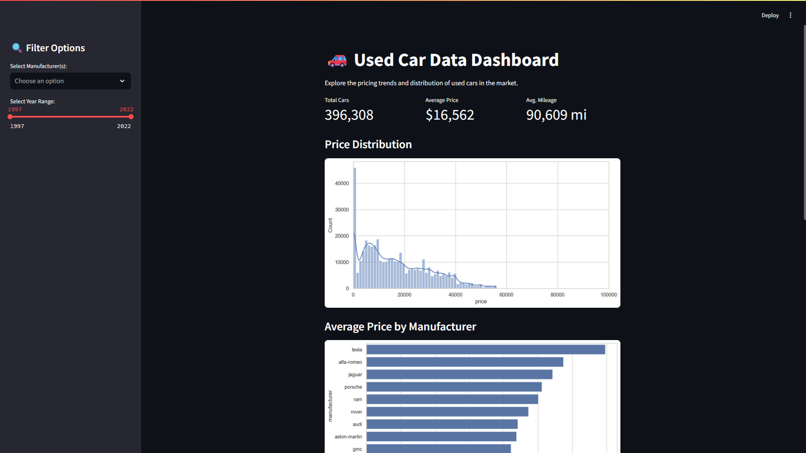
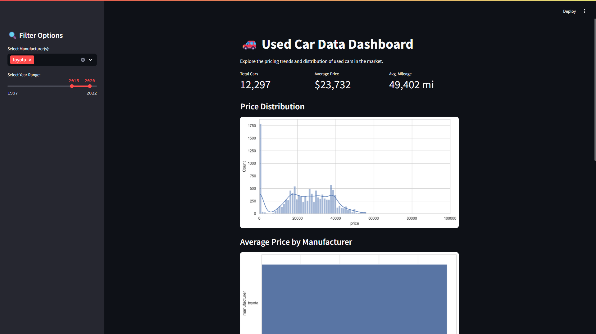
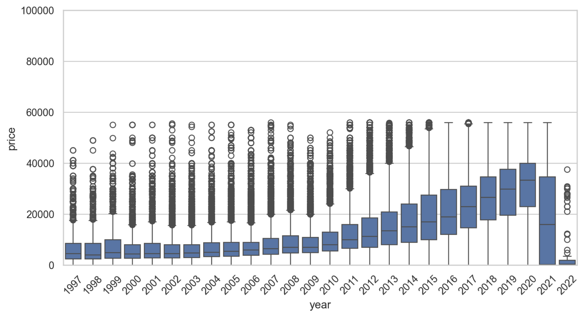
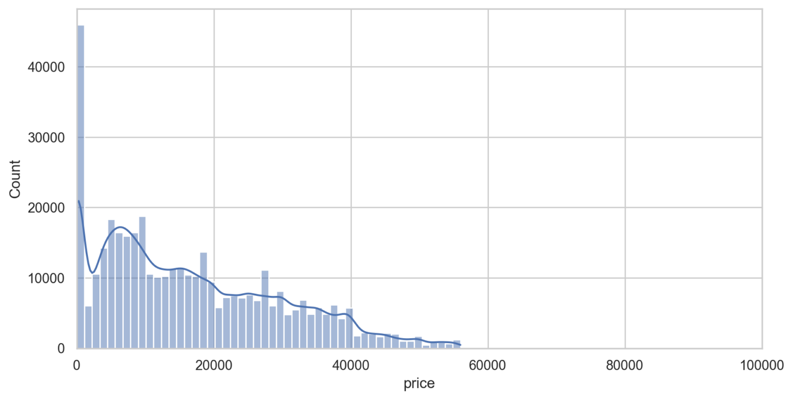

### 🚗 Used Car Data Analysis

This project explores a used car dataset to uncover insights and trends in the U.S. second-hand car market. The goal is to understand factors that influence car prices and present the findings in an interactive Streamlit dashboard.

---

#### 🎯 Objective

- Analyze used car data from various sources
- Find relationships between price and attributes like year, condition, fuel type, and mileage
- Visualize the findings
- Create an interactive dashboard for user exploration

---

#### 🔍 Dataset

- `used_cars.csv`: Raw dataset
- `cleaned_used_cars.csv`: Cleaned dataset after preprocessing
- `used_cars.db`: SQLite database used for SQL analysis

---

#### 🧪 Project Phases

1. **Data Understanding**: Understand the Data Structure
2. **Data Cleaning & Preprocessing**: Handle missing values, filter outliers, standardize columns
3. **EDA (Exploratory Data Analysis)**: Visualize relationships between variables
4. **SQL Analysis**: Generate insights using SQL queries via SQLite
5. **Dashboard**: Create an interactive app using Streamlit

---

#### 🧩 Key Findings

- **Ford and Chevrolet** dominate the dataset
- **Diesel vehicles** generally have higher prices than gasoline ones
- Newer vehicles with **lower mileage** command higher prices
- **SUVs and Pickup Trucks** are more expensive on average
- Vehicle **condition** is strongly correlated with price

---

#### 📊 Dashboard

Users can:
- Filter by manufacturer and year
- See KPI cards for total listings, average price, and mileage
- View interactive charts including:
  - Price Distribution
  - Average Price by Manufacturer
  - Price by Year
  - Mileage vs Price






---

#### 🛠 Tools Used

- Python: `pandas`, `seaborn`, `matplotlib`
- SQL: SQLite
- Streamlit: for dashboard
- Jupyter Notebook: for coding data analysis

---

#### ▶️ How to Run

Follow these steps to launch the dashboard locally:

1. Install dependencies:
    ```bash
    pip install -r requirements.txt
    ```

2. Run the Streamlit app:
    ```bash
    streamlit run streamlit_app/app.py
    ```

#### 📥 Download Dataset
Due to GitHub file size limits, you can download the raw dataset,cleaned dataset, SQLite from [Google Drive link here: https://drive.google.com/drive/folders/19CWeFBnatdf-Vu1nGcEgidDJ3wLMQtph?usp=sharing].
